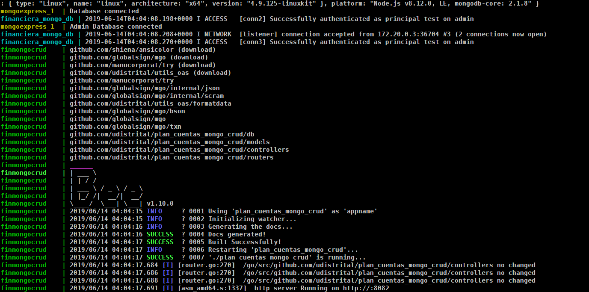

# plan_cuentas_mongo_crud

El API plan_cuentas_mongo_crud proporciona interfaces para la manipulación (CRUD) de los datos almacenados en una base de datos no relacional MongoDB (rubros, apropiaciones, fuentes de financiamiento, cpd, crp, vigencias)

Esta API representa la capa de datos del sistema de gestión financiero KRONOS.

## Especificaciones Técnicas

### Tecnologías Implementadas y Versiones

- [Golang](https://github.com/udistrital/introduccion_oas/blob/master/instalacion_de_herramientas/golang.md)
- [BeeGo](https://github.com/udistrital/introduccion_oas/blob/master/instalacion_de_herramientas/beego.md)
- [MongoDB]()
- [Docker](https://docs.docker.com/engine/install/ubuntu/)
- [Docker Compose](https://docs.docker.com/compose/)

### Variables de Entorno

```shell
PLAN_CUENTAS_MONGO_CRUD__PORT = [descripción]
PLAN_CUENTAS_MONGO_CRUD__DB_URL = [descripción]
PLAN_CUENTAS_MONGO_CRUD__DB_NAME = [descripción]
PLAN_CUENTAS_MONGO_CRUD__DB_USER = [descripción]
PLAN_CUENTAS_MONGO_CRUD__DB_PASS = [descripción]
PLAN_CUENTAS_MONGO_CRUD__DB_AUTH = [descripción]
```

**NOTA:** Las variables se pueden ver en el fichero conf/app.conf y están identificadas con `PLAN_CUENTAS_MONGO_CRUD__...`

### Ejecución del Proyecto

```shell
#1. Obtener el repositorio con Go
go get github.com/udistrital/plan_cuentas_mongo_crud

#2. Moverse a la carpeta del repositorio
cd $GOPATH/src/github.com/udistrital/plan_cuentas_mongo_crud

# 3. Moverse a la rama **dev**
git pull origin dev && git checkout dev

# 4. alimentar todas las variables de entorno que utiliza el proyecto.
PLAN_CUENTAS_MONGO_CRUD__PORT=8080 PLAN_CUENTAS_MONGO_CRUD_DB_URL=127.0.0.1:27017 PLAN_CUENTAS_MONGO_CRUD__SOME_VARIABLE=some_value bee run
```



### Ejecución Dockerfile

```shell
# docker build --tag=plan_cuentas_mongo_crud . --no-cache
# docker run -p 80:80 plan_cuentas_mongo_crud
```

### Ejecución docker-compose

```shell
#1. Clonar el repositorio
git clone -b dev https://github.com/udistrital/plan_cuentas_mongo_crud

#2. Moverse a la carpeta del repositorio
cd plan_cuentas_mongo_crud

#3. Crear un fichero con el nombre **custom.env**
# En windows ejecutar:* ` ni custom.env`
touch custom.env

#4. Crear la network **back_end** para los contenedores
docker network create back_end

#5. Ejecutar el compose del contenedor
docker-compose up --build

#6. Comprobar que los contenedores estén en ejecución
docker ps
```

### Ejecución Pruebas

Pruebas unitarias

```shell
# Not Data
```

## Estado CI

| Develop | Relese 1.1.0 | Master |
| -- | -- | -- |
| [](https://hubci.portaloas.udistrital.edu.co/udistrital/plan_cuentas_mongo_crud) | [](https://hubci.portaloas.udistrital.edu.co/udistrital/plan_cuentas_mongo_crud) | [](https://hubci.portaloas.udistrital.edu.co/udistrital/plan_cuentas_mongo_crud) |

## Licencia

This file is part of plan_cuentas_mongo_crud.

plan_cuentas_mongo_crud is free software: you can redistribute it and/or modify it under the terms of the GNU General Public License as published by the Free Software Foundation, either version 3 of the License, or (at your option) any later version.

plan_cuentas_mongo_crud is distributed in the hope that it will be useful, but WITHOUT ANY WARRANTY; without even the implied warranty of MERCHANTABILITY or FITNESS FOR A PARTICULAR PURPOSE. See the GNU General Public License for more details.

You should have received a copy of the GNU General Public License along with plan_cuentas_mongo_crud. If not, see https://www.gnu.org/licenses/.
